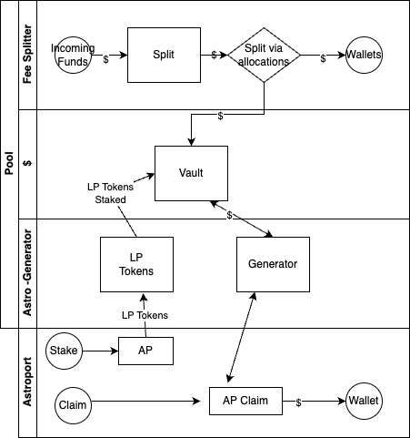

# WARNING
v0.2.1 has been [audited](https://github.com/SCV-Security/PublicReports/blob/main/CW/NFTswitch/NFTswitch%20-%20Fee%20Split%20Contract%20Audit%20Report%201.0.pdf)
you should still exercise caution, and do your own research.

# PFC-Fee-Splitter protocol contracts


## Components

* [Fee Split](./contracts/pfc-fee-splitter) - Implementation of fee splitter.
* [Dual incentive Rewards](./contracts/pfc-astroport-generator) - staking reward thingy for astroport 
* [Vault](./contracts/pfc-vault-contract) - simple vault to work alongside the dual reward 


# how do/can they interact ?



native denoms comes into the system via 'fee-splitter' contract. the funds get split via the allocation table
and either TRANSFERed to a wallet, or SEND to a smart contract, in this case, the 'vault' contract.

the vault accumulates the denoms, and allows people who hold the governance token (in astroport's case the LP token of the pair) to claim their portion when they choose.

the person needs to deposit their governance token in to start accumulating rewards.

the astroport-generator sits between the end-user and the vault itself, so the vault only sees a single address (the astroport smart contract) as the holder of it's LP tokens.
it forwards the 'claim' function from astroport, and send rewards (in total for the smart contract).
Astrport then determines how much of that sends to the individual. (how is out of scope)
## Development

### Environment Setup

- Rust v1.56.1+
- `wasm32-unknown-unknown` target
- Docker

1. Install `rustup` via https://rustup.rs/

2. Run the following:

```sh
rustup default stable
rustup target add wasm32-unknown-unknown
```

3. Make sure [Docker](https://www.docker.com/) is installed

### Unit / Integration Tests

Each contract contains Rust unit and integration tests embedded within the contract source directories. You can run:

```sh
cargo unit-test
cargo integration-test
```

### Compiling

After making sure tests pass, you can compile each contract with the following:

```sh
RUSTFLAGS='-C link-arg=-s' cargo wasm
cp ../../target/wasm32-unknown-unknown/release/cw1_subkeys.wasm .
ls -l cw1_subkeys.wasm
sha256sum cw1_subkeys.wasm
```

#### Production

For production builds, run the following:

```sh
docker run --rm -v "$(pwd)":/code \
  --mount type=volume,source="$(basename "$(pwd)")_cache",target=/code/target \
  --mount type=volume,source=registry_cache,target=/usr/local/cargo/registry \
  cosmwasm/workspace-optimizer:0.10.4
```

This performs several optimizations which can significantly reduce the final size of the contract binaries, which will
be available inside the `artifacts/` directory.

## License
ASL 2.0 - see [LICENSE](./LICENSE) 

# PFC
If you think this was useful, feel free to delegate to the [PFC](https://station.terra.money/validator/terravaloper12g4nkvsjjnl0t7fvq3hdcw7y8dc9fq69nyeu9q) validator. It will help defray the costs.

[PFC](https://twitter.com/PFC_Validator) - As Terra is all about the Perpetual Fee Chain right... feel free to drop me a line

